

# job4j_dreamjob
### Description of the project.
This project represents the java web technology. This is the first WEB project. Here we have developed a simple application describing the exchange of work. There are two types of users in the system: candidates and HR managers. Candidates publish their resumes by uploading photos. HR specialists publish job vacancies. HR managers and candidates can edit their ads. Tests were created using mockito.

### Used technologies
- Java EE 8
- MVC as design pattern.
- Servlet
- Slf4j for logging.
- JDBC
- Fileupload
- PostgresSQL
- Front(jsp/jstl/js/HTML/bootstrap/CSS/ajax)
- Jackson for JSON building.
- Tomcat Web server
- Maven as a build system
- Mockito
- CI/CD Travis
- Checkstyle
- Jacoco

### Steps of work
After you pushed webapp, you can use it. Steps of work are next:
1. An unregistered user sees such a page
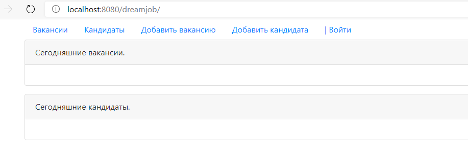

2. Authorization page
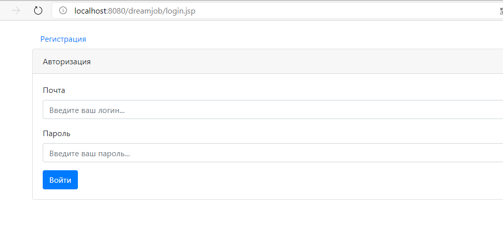

3. Validation for authorization
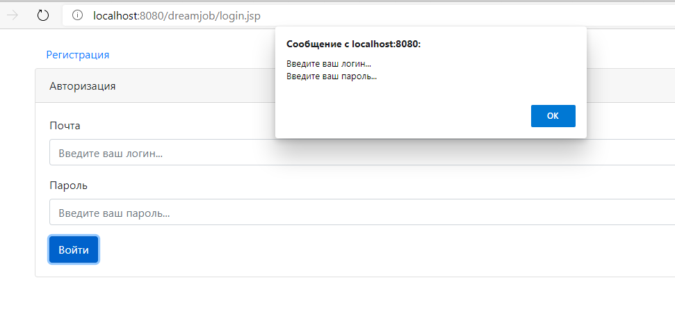

4. Incorrect filling in of the authorization data
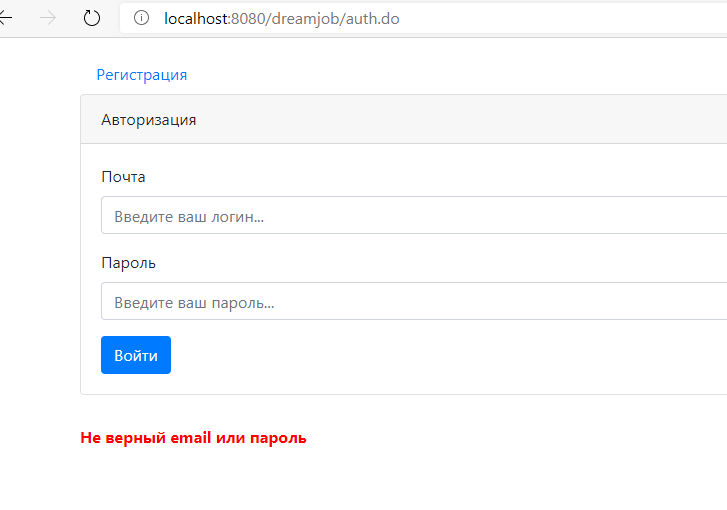

5. Access to the list of vacancies after authorization
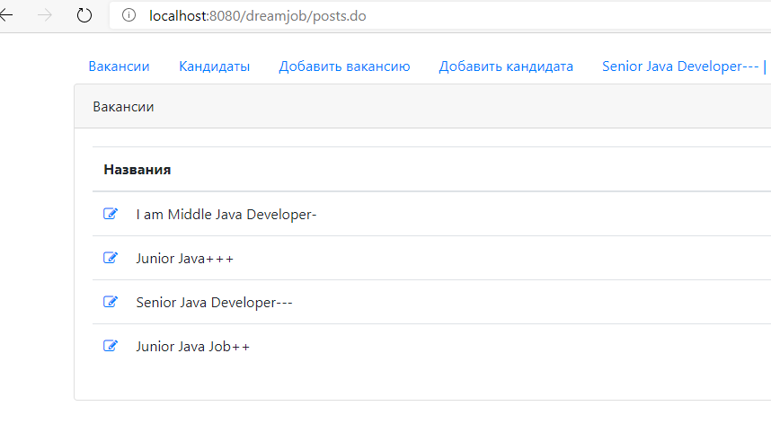

6. Adding a new job

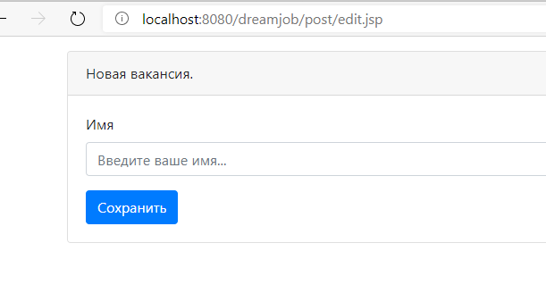
   

7. List of candidates

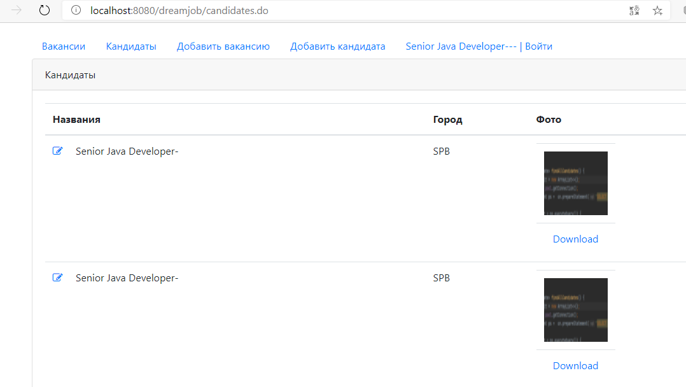

8. Adding a new candidate

 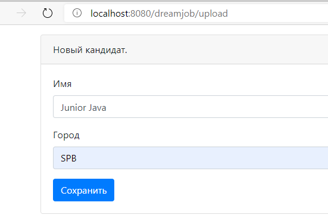

9. Upload a photo when adding a candidate
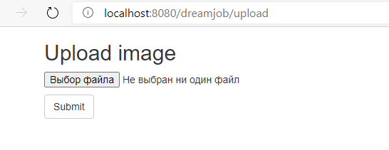

10. Editing a vacancy

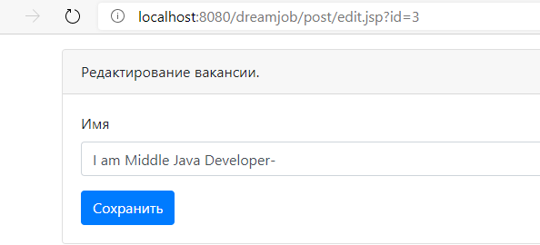

11. Editing the candidate
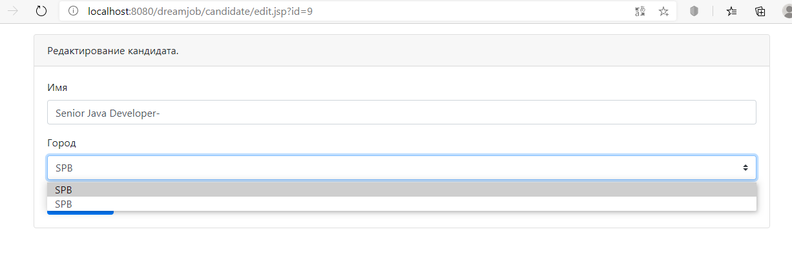
